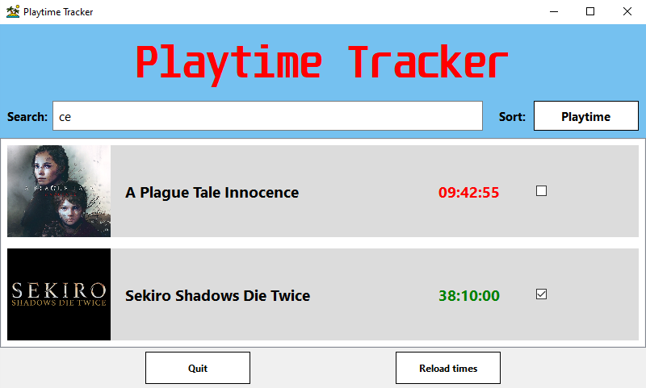

## About

- This is a app made for tracking sessions when playing games that don't have their own trackers (or even if they do)
- Main app displays the game along with the current playtime and *completed* checkmark
- App is made in python using PyQt library

## Usage

- Download *Playtime Tracker.exe*, *Session Tracker.exe*, *gamesExeNames.json* and GameIcons folder

## Playtime Tracker

- Launch **Playtime Tracker.exe** to see games and their respective playtimes

- To add pictures to game listings, put a .png file with the game name (can be custom but must match the game name in *gamesExeNames.json*) in the folder named GameIcons (GameIcons must be in the same directory as the executable)

- Double clicking a game opens *Session Preview* for that game

- Clicking on *Sort* button toggles game sorting between *Name* and *Playtime*

## Session Tracker

- Launch **Session Tracker.exe**, then launch your game of choice, the tracker should say that it started tracking and list the game. After you close the game, tracker will stop by itself depending on the *ClosingScanInterval*. It will display the save location directory and the session playtime

- If the tracker doesn't recognise your game, add the game name into the **gamesExeNames.json** like so: "gameExe.exe": "GameName (can be whatever)"

- Run **gameNameOrder.py** to sort game names in *gamesExeNames.json* alphabetically

- When the game is started, session playtime tracking will begin. Update interval is 10 min by default to reduce system load

- You can edit the config for more options (check below). If there is no config file *Session Tracker.exe* will create one with default values on launch

## Config

**GamesPath** - specify a path where the game session logs will be saved. Default saves to the same location as .exe file in *Games* directory (enter without quotation marks)

**OpeningScanInterval** - interval of seconds after which the check if a game is open will occur

**ClosingScanInterval** - interval of seconds after which the check if tracked game is no longer open will occur

**CurrentPlaytimeUpdateInterval** - interval of seconds afterr which the current session playtime updates

**GameExeNames** - file with names of game .exe files and their full names

## Build

pyinstaller --noconfirm --onefile --console --icon "icon path" ".py file path"